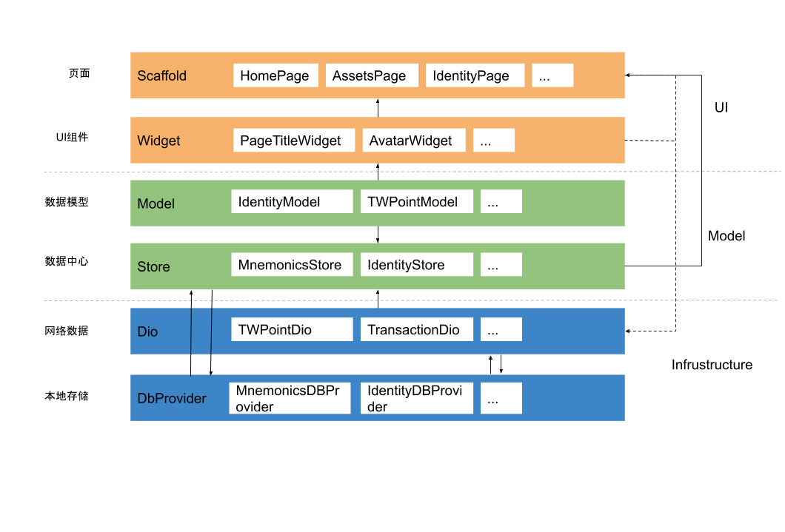

# Purpose

This doc will define our wallet's type and give a architecture guideline.

# Function

TW wallet if a POC program, we will prove that the concept of digital asset and digital identity can be integrated into a App, which would support authority management and asset management of DAPP.

The wallet try to fullfil some important requirements, including but not limited to:

1. Wallet should help user register digital identity in blockchain.
2. Wallet should help user manage digital asset, user would view, transfer asset in the wallet.
3. Wallet should have a place to run DAPP.
4. Wallet should help user get truthful claim.
5. Wallet should help user show truthful claim to service provider.

# Architecture Design

## Functional Design

According to functional requirements, wallet should consider these technology:

1. Wallet can generate DID to identify user's digital identity.
2. We should write a smartContract to store the relationships of DID, Address, Public Key.
3. Wallet can create key pair and support HD wallet.
4. Wallet can connect to blockchain to get information of account.
5. Wallet can sign a transaction with private key and connect to blockchain to broadcast transaction.
6. Wallet should have a webview container to run DAPP and have a bridge to communicate with DAPP. Communicate Bridge should be design to fullfil different requirements of DAPP.
7. Wallet should integrate truthful claim CA, these CAs is a plugin and can be removed.
8. Wallet should have ability to scan a QR Code and let use give authorization to show some necessary claim information to service provider.

### Digital Identity Register Flow

1. generate DID uri. 
2. call smart contract interface (this step can go through server) to register relationship of DID, Address, Public key

### Create digital asset account
 
1. generate 12 mnemonic words
2. let user input 6 pin codes, this pin is not BIP39 Passphrase
3. store pin in secure storage
4. generate seed and BIP32 Root Key
5. when user click add, show address of m/44'/60'/0'/0/{index} in the ui.

> store mnemonic words here

> pin is not BIP39 Passphrase, because we want user can restore account by mnemonic words in any eth wallet without passphrase

### Difference between address and DID

We can choose different algorithm to generate address and DID. In our wallet, we just connect to quorum and use ETH address. We can use Eth address and add prefix to generate DID, such as "did:tw:eth-address".

User can transfer TWP with DID, but the feature do not mean DID bind to private key of address. We should remember DID has it's own smart contract, we can define who can control DID. For example, we can add a controller to DID smart contract and change it in the future.

For make our POC easier, we combine DID and wallet account, they have same private key.

### Transfer TWP

1. select wallet account to transfer
2. fill to-address and amount
3. sign transaction with private key

### Import DID

### Import Wallet Account

as same as Import DID

### Get Claim 

### Show Claim 

### Load DAPP

### Communicate with DAPP

## Non-functional Design

We should consider some Non-functional requirement in wallet.

### Security

1. We prefer KeyStore file instead of private key. 
2. KeyStore has password and wallet should not sore password.
3. We store KeyStore file in secure storage.
4. Wallet should not log password or sensitive data to file or console.
5. Config file and database should be encrypted.
6. Wallet should use certification pinning to avoid man in the middle attack.
7. Wallet should use https to communicate with server.
8. Wallet should communicate with server with encrypted data above https.
9. Communicate encrypt key should be changed frequently.
10. Android APK should be reinforcement. 
11. Can not record screen while showing mnemonic words.

we should dig into details of encrypted communication and reinforcement of APK.

### State Management

Wallet should split state out of view to make our application has hierarchs. MobX is a library makes state management simple and scalable by transparently applying functional reactive programming (TFRP).

### UI Framework

Flutter is Google's UI toolkit for building natively compiled applications for multiply targets. Wallet use Flutter as UI Framework to build Android and iOS application.

### Nonce management

Two methods:

1. get nonce from blockchain or server.
2. handle by client nonce pool.

we choose 1.

### Cryptograph Library

### Http/Https Library

### Hot upgrade Framework

### Notification Mechanism

# Future technical consideration

We should consider requirements evolvement in the future. I list some of them here:

1. Support more tokens which may different from erc20
2. DID have it's own uri algorithm
3. Forget DID private key
4. Forget digital asset private key
5. sign transaction for other apps
6. show claim for other apps
7. support DAPP store
8. support new encrypt library
